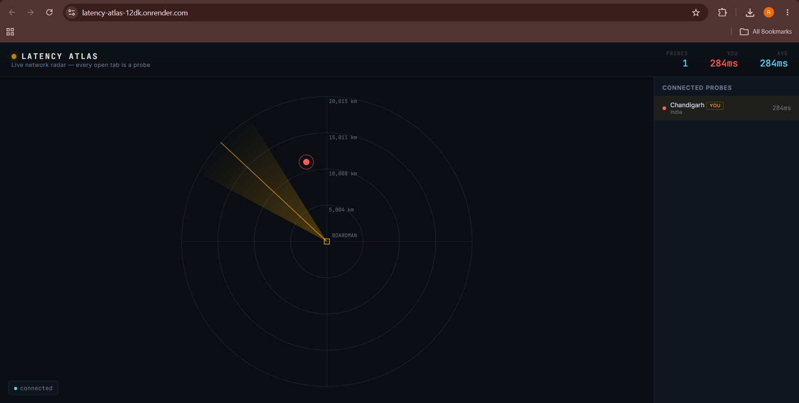

<div align="center">

# 📡 Latency Atlas

**A live, crowdsourced network-latency radar, built entirely on WebSockets.**

Every browser tab that opens this page becomes a probe. The server pings it continuously,
geolocates it, and broadcasts the whole swarm's position and latency to everyone else
watching — in real time, with no polling and no page refresh.

[](https://www.python.org/)
[](https://fastapi.tiangolo.com/)
[](https://developer.mozilla.org/en-US/docs/Web/API/WebSockets_API)
[](https://render.com)
[](LICENSE)

**[🔴 Live demo →](https://latency-atlas-12dk.onrender.com)**

</div>

---

<!--
SCREENSHOT: open your live Render URL with 2-3 tabs/devices connected so the
radar has real probes on it, take a screenshot, save it as docs/screenshot.png
in the repo, and this will render automatically. Don't skip the multi-tab
part -- an empty radar with one dot is a much weaker first impression.
-->
<p align="center">
  
</p>

## Why this is different

Most WebSocket demo projects are chat apps. This one isn't, the socket is doing
something a REST endpoint genuinely can't: it's the timing mechanism itself. The
server measures your real round-trip latency over the same connection it uses to
push you everyone else's, and every client renders that shared state onto a radar
using a real **azimuthal-equidistant projection**, distance from center is actual
great-circle distance (haversine), and angle is actual compass bearing from the
server's own geolocated position. It's not a stylized map. The geometry is real.

## How it works

```
Browser tab  --opens WS-->  FastAPI hub  --IP lookup-->  Geolocates the probe
                                  |
                          ping every 1.5s, times the pong
                                  |
                     broadcasts full swarm state to every client
                                  |
                     each client projects it onto a live radar
```

1. A browser tab opens a persistent WebSocket connection to the server.
2. The server resolves that client's approximate location from its IP.
3. The server pings the client every 1.5 seconds over the open socket and times
   the reply, that round trip *is* the latency measurement, not a simulated one.
4. Every latency update triggers a broadcast of the full swarm's state (city,
   coordinates, current latency for every connected client) to **all** clients.
5. Each client projects that shared state onto a rotating radar scope centered on
   the server's own location, with a sweep line, range rings labeled in real
   kilometers, and a live sidebar ranked by latency.

## Features

- 🌍 **Real geolocation**: IP-based lookup on connect, not mock coordinates
- 📶 **Live RTT measurement**: genuine ping/pong timing over the open socket, not a fake number
- 📡 **Real radar geometry**: haversine distance + compass bearing, not a decorative map
- 🔄 **Instant broadcast**: every client sees every other client update in real time, no polling
- 📱 **Works cross-device**: open it on your phone and laptop side by side and watch both probes appear
- 🪶 **Zero frontend dependencies**: vanilla JS and `<canvas>`, no framework, no build step

## Tech stack

| Layer | Choice | Why |
|---|---|---|
| Backend | FastAPI + native `WebSocket` | first-class async WebSocket support, no extra layer needed |
| Latency | Server-driven ping/pong loop | measures real RTT rather than trusting client-reported numbers |
| Geolocation | `httpx` + [ipapi.co](https://ipapi.co) | async, non-blocking IP lookups on connect |
| Frontend | Vanilla JS + Canvas 2D | keeps the radar rendering fast and dependency-free |
| Projection | Haversine distance + bearing (hand-implemented) | genuine geographic math, not a canned mapping library |
| Deploy | Render (`render.yaml` included) | one-click deploy straight from this repo |

## Try it yourself

**Live:** **[https://latency-atlas-12dk.onrender.com](https://latency-atlas-12dk.onrender.com)** - open it on two devices at once (say, your laptop and phone off Wi-Fi) to watch two real, independently-geolocated probes appear on the radar together.

**Locally:**

```bash
git clone https://github.com/Raaaj2005/latency-atlas.git
cd latency-atlas
python -m venv .venv && source .venv/bin/activate   # .venv\Scripts\activate on Windows
pip install -r requirements.txt
uvicorn main:app --reload
```

Then open `http://127.0.0.1:8000` in a few tabs. On localhost, private IPs can't
be geolocated, so probes get randomized demo cities, the latency numbers stay real,
only the position is simulated.

## Project structure

```
latency-atlas/
├── main.py              FastAPI app: WebSocket hub, ping loop, geolocation, broadcast
├── static/
│   └── index.html        Radar UI: canvas rendering, projection math, WS client
├── requirements.txt
├── render.yaml           One-click Render deploy config
└── README.md
```

## Known limitations

- IP geolocation is city-level and rate-limited on the free `ipapi.co` tier, fine for a demo, not for production scale.
- State broadcasts on every latency update rather than on a fixed tick, which
  is simple but gets chattier as more clients connect. A batched, fixed-interval
  broadcast loop would scale further.
- No persistence by design, the swarm is "who's here right now," and resets
  on server restart.

## Author Details

**Name:** Raj Fatehveer Singh Brar<br>
**Roll No.:** 102317090<br>
**Email ID:** rbrar_be23@thapar.edu<br>
**University:** Thapar Institute of Engineering and Technology

---

<div align="center">
<sub>Built by <a href="https://github.com/Raaaj2005">Raaaj2005</a></sub>
</div>
